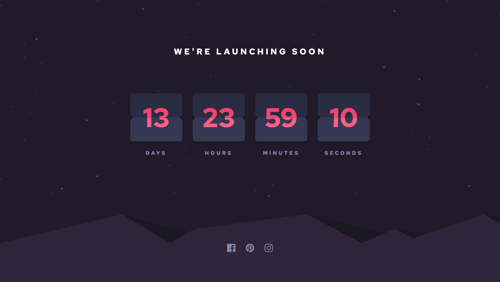
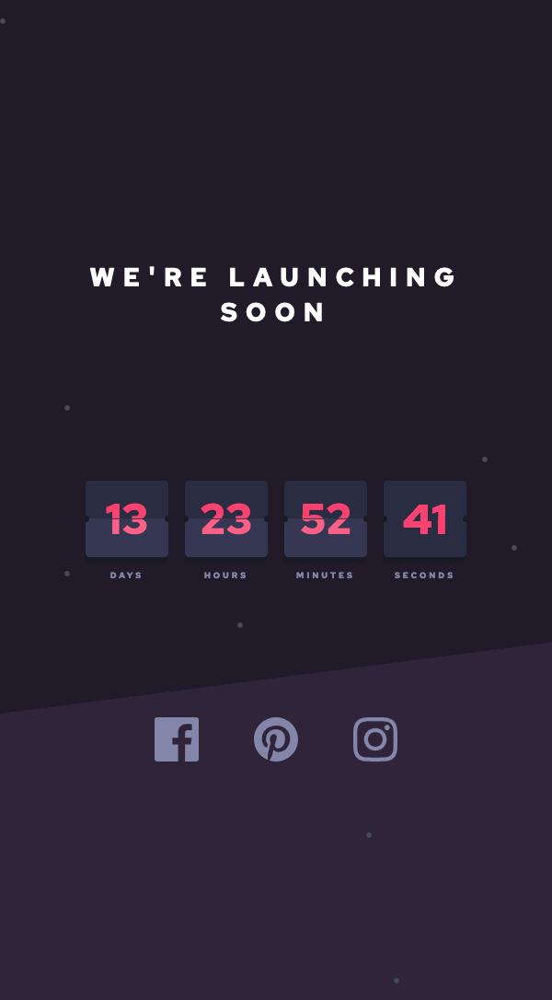

# Frontend Mentor - Launch countdown timer solution

## Table of contents

- [The challenge](#the-challenge)
- [Screenshot](#screenshot)
- [Links](#links)
- [My process](#my-process)
  - [Built with](#built-with)
  - [What I learned](#what-i-learned)
  - [Continued development](#continued-development)
  - [Useful resources](#useful-resources)
- [Author](#author)
- [Acknowledgments](#acknowledgments)

### The challenge

Users should be able to:

- See hover states for all interactive elements on the page
- See a live countdown timer that ticks down every second (start the count at 14 days)
- **Bonus**: When a number changes, make the card flip from the middle

### Screenshot

### Built with

- Semantic HTML5 markup
- CSS custom properties
- Flexbox

### What I learned

I learned about mutationObserver in javaScript, it was so usefull to implement flip class just on element which we want to have flip animation

## Author

- Frontend Mentor - [@maziarja](https://www.frontendmentor.io/profile/maziarja)

## Acknowledgments

I appreciate Jonas Schmedtmann for his awesome courses on Udemy,
Also 'Web Dev Simplified' on youtube where I learned about mutationObserver.
